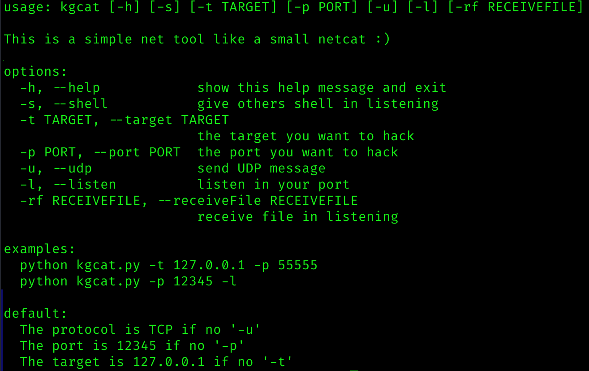
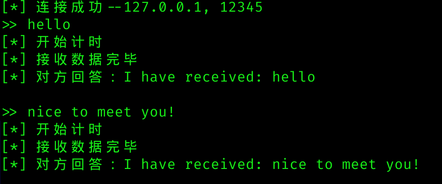
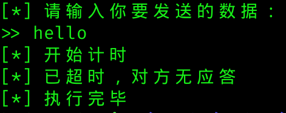
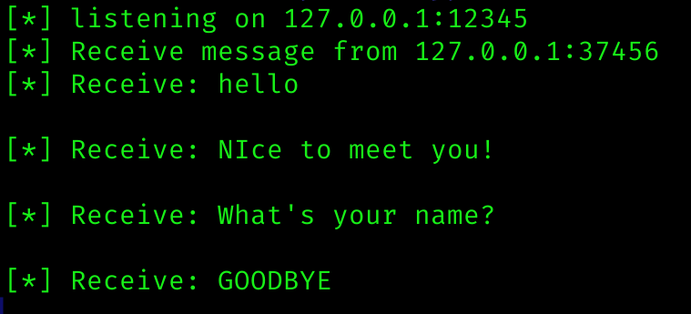
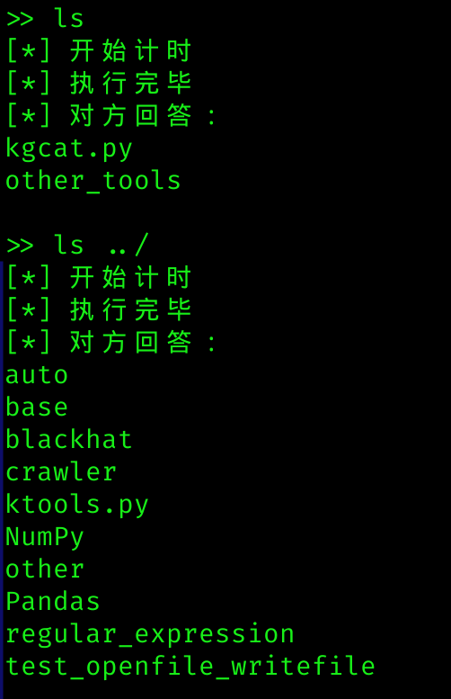

# 前言
这款简单的python程序实现了部分netcat的功能（当然没有netcat强大）。  
该程序的功能有：监听端口、监听并写入文件、监听并执行shell命令、发送tcp数据、发送udp数据。输入`--help`可获取更多信息！  
  
  
  
# 发送数据
## TCP
Example: `python kgcat.py -t 127.0.0.1 -p 12345`
  
  
  
**注意**：我设立了计时功能，默认情况下，当发送一个包后，若一直无应答，则最多会等待4秒。之后会断开连接并告诉你对方无应答。 
  
*特殊功能：当收到应答为GOODBYE时，会主动断开连接。搭配kycat.py的普通监听模式时（或other\_tools文件夹中的tcp\_server），当我们发送GOODBYE时，对方会返还一个GOODBYE，然后断开连接，从而实现类似[FIN],[FIN, ACK]的效果。*   
## UDP
使用`-u`,可以发送UDP报文。 
  
  
  
# 接收数据
## 普通监听
使用`-l`进入该模式。  
  
默认情况下，最多同时有五个进程连接同一端口，即一个端口最多监听五个套接字。  
该模式下，每当收到数据，会回复给对方一个应答（类似[ACK]）。  
当收到GOODBYE时，会应答GOODBYE，并断开连接。  
  
  
  

## 写入文件
使用`-rf FilePath`进入该模式（必须同时有`-l`）  
该模式下，发送方输入的命令都会保存到你指定的文件中。发送方可以一直发送命令，直到发送GOODBYE，该文件会关闭并保存。  

## 获取shell
使用`-s`进入该模式（必须同时有`-l`）  
该模式下，发送方输入的命令会被当作shell命令在shell中执行。并将shell的输出结果回复给发送方。  
  
   
  
# 补充
任何时候，你都可以通过`Ctrl+c`结束程序。  

# 技术回顾
## 一段时间跳过某条代码
我用装饰器+signal库实现了该功能，此前也尝试过threading库的Timer组件和eventlet库，都不太好使。Eventlet库无法结束子进程，Timer组件功能太少。  
在函数中使用`signal.alarm(time)`，如果超时，则主动结束该函数并调用handler。将signal代码封装为一个装饰器，后面要跳过的代码设定为函数并用装饰器修饰。    
## 重要库--argparse
该库可以简单实现命令行程序的‘外形’，即通过`-h`、`-t`等参数实现多功能命令，并将各参数传入代码，以供后面的代码使用。  
## 重要库--subprocess
该库很多功能可以替换os库。重要方法`subprocess.check_output`可以在shell中执行命令并返回shell的输出。  
## 重要库--socket
我们的网络编程部分都基于该库。  
## 重要库--threading
因为GIL的存在，threading的多线程并不能使用多核，所以事实上，永远只能有一个线程在运行python代码。但个人认为，python多线程至少可以实现逻辑上的虚拟隔离，从而‘假装’在同时运行多线程，即便没有效率的提升。  
如果想提升效率，可以使用多进程。  
线程与线程之间的交流需要靠信号或全局变量等形式，它们之间很难传递参数。  
## 特殊库--shlex
使用`shlex.split(cmd)`，可以将命令拆分成Linux shell命令的格式，避免一些特殊的shell命令出错。python使用Linux shell的命令时必备。  
当不使用该语句拆分时，传入shell的带空格的长命令会整个被当作一个/bin下的文件。  
但即便如此，依然有一些命令如`xxx | grep x`无法执行
